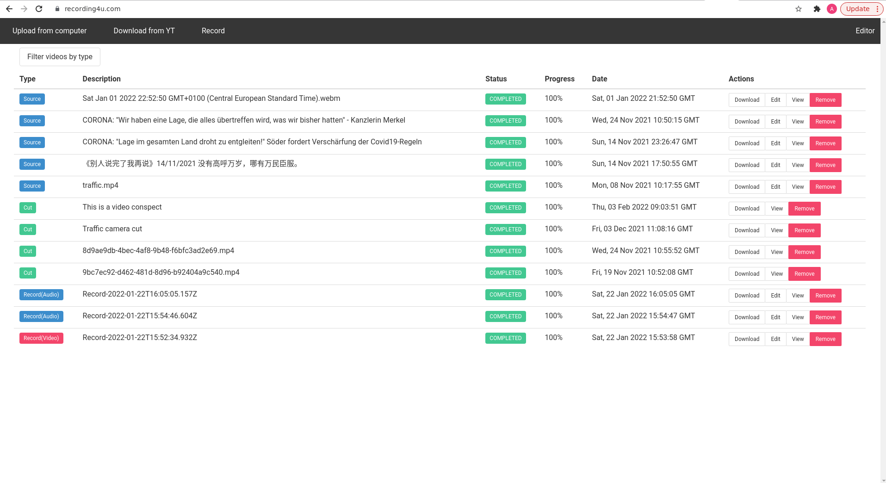
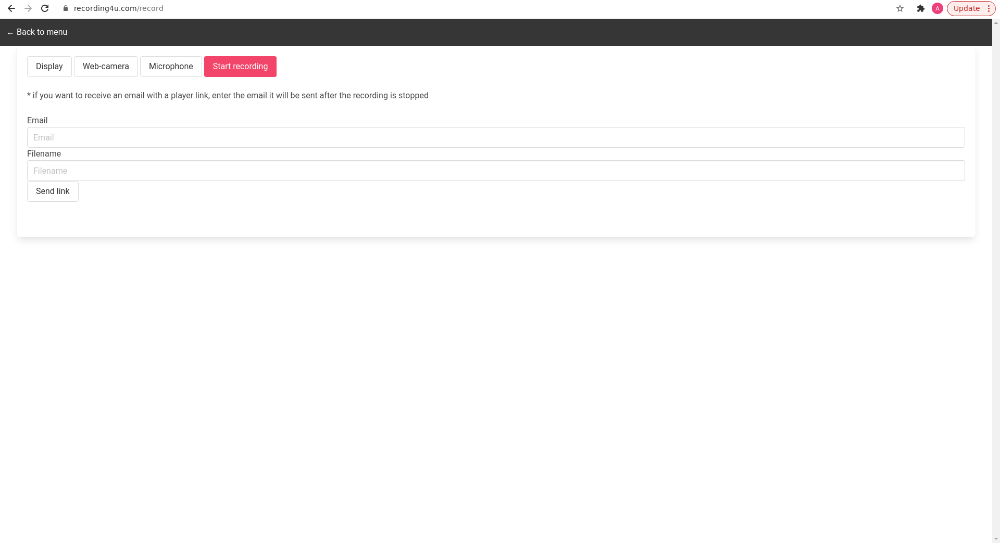
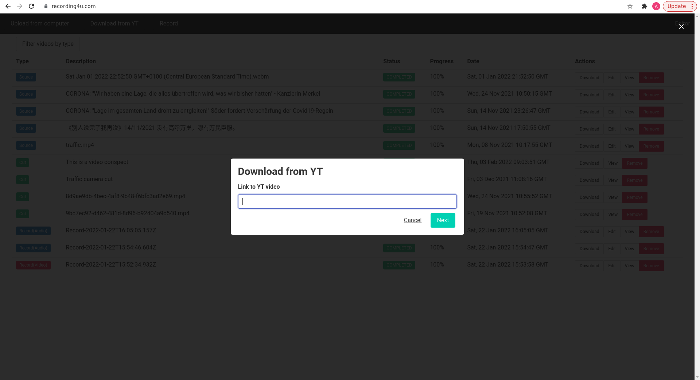
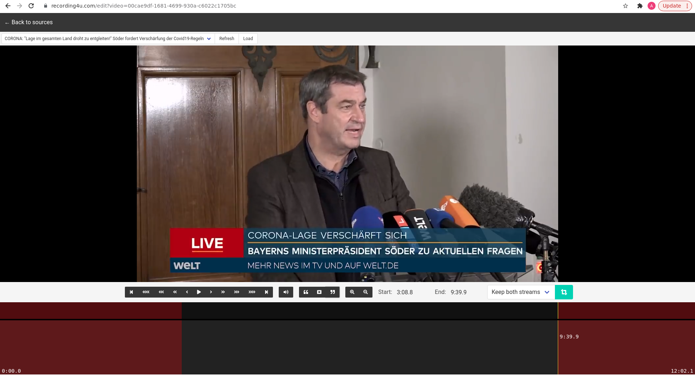

# Site
https://recording4u.com

Сайт

 
Запись экрана и веб-камеры

 
Скачивание видео с youtube
 

 
Редактирование видео

# Configuration

Services and API are configured via `settings.py` module

`DATABASE` - database access URL (described in https://docs.sqlalchemy.org/en/13/core/engines.html#database-urls)

`VIDEOCUT_SERVICE_ADDR` - address used by video processing service

`VIDEOCUT_SERVICE_WORKERS` - number of simultaneous workers in processing service

`DOWNLOAD_SERVICE_ADDR` - address used by video downloading service

`DOWNLOADS_LOCATION` - location used to store downloaded/uploaded source videos

`CUTS_LOCATION` - location used to store processed fragments

`YOUTUBE_DL_EXECUTABLE` - location of youtube-dl executable

# Installing python dependencies

`pip install -r requirements.txt`

# Setting up database

Specify URL in `alembic.ini` and execute `alembic upgrade head`

# Running youtube download service

In repository root, run

`python3 -m download_service`

# Running video processing service

In repository root, run

`python3 -m processing_service`

# Running API server

Using Gunicorn WSGI server, run

`gunicorn -b 0.0.0.0:4040 --access-logfile - routes:app`